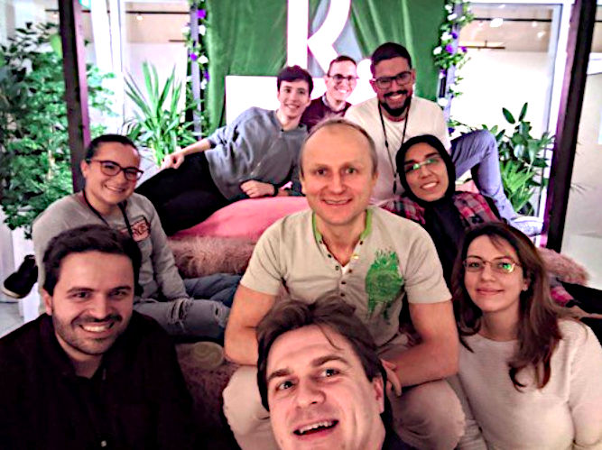

# Game of Life

This implementation of Conway's Game of Life is inspired by the Code Retreat
on November the 16th 2019 at Klarna ([klarna.com](https://www.klarna.com/)).
Nasim Salmany, a developer within the team, describes this event in her
article on Medium
([link](https://medium.com/@nasimsalmany/klarna-global-day-of-code-retreat-on-16-nov-2019-db228d02d155)).



## Player Guide

Open `docs/index.html` in a browser or visit the page where this project is
deployed: http://aexg.github.io/goltdd

## Developer Guide

Prerequisites: `node` and `npm`.

Source code (in `docs/` for publishing on GitHub pages):
- `gol_engine.js`: game engine implementing game rules
- `gol_rendering.js`: rendering using canvas
- `index.html`: placeholder for canvas

Install dependencies:
```
$ npm install
```

Run tests with `jest`, coverage report is stored in  `/coverage/lcov-report/index.html`.
```
$ npm test
```

Feel free to point out defects and to suggest improvements!
